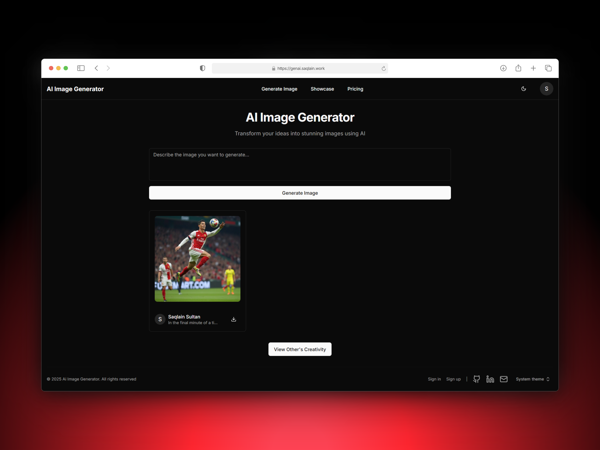

# 🖼️ AI Image Generator  

An AI-powered image generator that allows users to create stunning visuals using **Nebius AI**. This project is built with modern web technologies to ensure scalability, performance, and seamless user experience.  

## 🚀 Live Demo  
🔗 [Live Project](https://genai.saqlain.work)  

## 💻 Tech Stack  
- **Frontend:** Next.js, React.js, TypeScript, TailwindCSS, Shadcn UI  
- **Backend:** Next.js API Routes, Prisma ORM, PostgreSQL  
- **AI Model:** Nebius AI  
- **Authentication:** NextAuth  
- **Storage:** Cloudinary  
- **Validation:** Zod  

## ✨ Features  
✅ Generate AI-powered images using Nebius AI  
✅ Secure user authentication with NextAuth  
✅ Store and manage images using Cloudinary  
✅ Responsive and modern UI with TailwindCSS & Shadcn UI  
✅ Data validation with Zod  
✅ Backend powered by Prisma ORM & PostgreSQL  

## 📸 Screenshots  




## 🛠️ Installation & Setup  

### 1️⃣ Clone the Repository  
```sh  
git clone https://github.com/saqlain991/Image-Gen_AI/  
cd Image-Gen_Ai  
```

### 2️⃣ Install Dependencies  
```sh  
npm install  
```

### 3️⃣ Set Up Environment Variables  
Create a `.env` file in the root directory and add the following:  
```env  
DATABASE_URL=your_postgresql_database_url  
NEXTAUTH_SECRET=your_nextauth_secret  
NEXTAUTH_URL=your_nextauth_url  
NEBIUS_API_KEY=your_nebius_ai_api_key  
CLOUDINARY_CLOUD_NAME=your_cloudinary_cloud_name  
CLOUDINARY_API_KEY=your_cloudinary_api_key  
CLOUDINARY_API_SECRET=your_cloudinary_api_secret  
```

### 4️⃣ Run Database Migrations  
```sh  
npx prisma migrate dev  
```

### 5️⃣ Start the Development Server  
```sh  
npm run dev  
```
The app will be available at `http://localhost:3000`.  

## 🚀 Deployment  
You can deploy this app on **Vercel** or any Next.js-supported platform.  


## 📜 License  
This project is open-source and available under the **MIT License**.  

## ⭐ Support & Contributions  
Feel free to fork the repo, raise issues, and contribute! If you like this project, **give it a star ⭐ on GitHub!**  

💻 **GitHub Repository:** [Your GitHub Repo Link](https://github.com/saqlain991/Image-Gen_AI/)  

---

